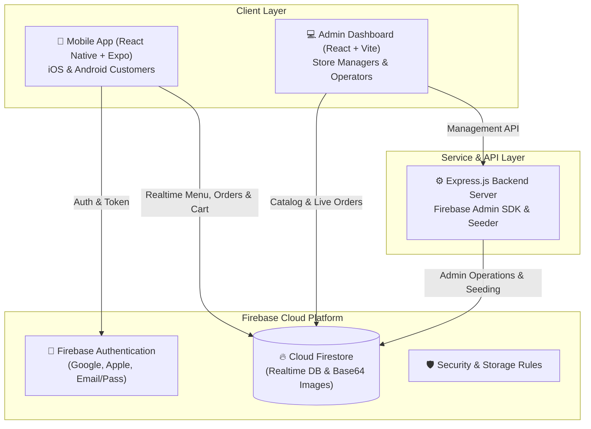

<h1 align="center">🍔 Food App</h1>

<p align="center">
  <strong>A full-stack, cross-platform food delivery and restaurant management ecosystem.</strong><br>
  Built with React Native & Expo, React & Vite, Node.js Express, and Firebase Cloud Services.
</p>

<p align="center">
  <em>Developed collaboratively by <a href="https://github.com/AbdelruhmanAshraf"><strong>Abdelrahman Elfekky</strong></a> &amp; <a href="https://www.mtarif.com"><strong>Mtarif (Tefooh)</strong></a></em>
</p>

<p align="center">
  <a href="https://reactnative.dev/"></a>
  <a href="https://expo.dev/"></a>
  <a href="https://react.dev/"></a>
  <a href="https://vitejs.dev/"></a>
  <a href="https://nodejs.org/"></a>
  <a href="https://firebase.google.com/"></a>
  <a href="#-license"></a>
</p>

---

## 📌 Table of Contents

- [Overview](#-overview)
- [Preview](#-preview)
- [System Architecture](#-system-architecture)
- [Key Features](#-key-features)
  - [Mobile Customer App](#1-mobile-customer-app-appfrontend)
  - [Web Admin Dashboard](#2-web-admin-dashboard-adminfrontend)
  - [Backend & Database](#3-backend--cloud-services-adminbackend)
- [Tech Stack](#-tech-stack)
- [Project Structure](#-project-structure)
- [Prerequisites](#-prerequisites)
- [Installation & Setup](#-installation--setup)
  - [1. Clone Repository](#1-clone-repository)
  - [2. Firebase Configuration](#2-firebase-configuration)
  - [3. Running Customer Mobile App](#3-running-customer-mobile-app)
  - [4. Running Admin Web Dashboard](#4-running-admin-web-dashboard)
  - [5. Running Backend & Seeding Data](#5-running-backend--seeding-data)
- [Firestore & Storage Security Rules](#-firestore--storage-security-rules)
- [Zero-Billing Free Image Solution](#-zero-billing-free-image-solution)
- [Credits & Attribution](#-credits--attribution)
- [License](#-license)

---

## 🌟 Overview

**Food App** is an all-in-one modern food delivery platform engineered for high performance, smooth user experiences, and straightforward store administration. It connects end customers directly with restaurant staff through a unified Firebase realtime backend.

The platform is divided into three primary components:
1. **`App/Frontend`**: Cross-platform customer mobile application for iOS and Android powered by React Native and Expo.
2. **`Admin/Frontend`**: High-speed, responsive web management dashboard built with React 18, Vite 5, Framer Motion, and Lucide icons.
3. **`Admin/Backend`**: Node.js & Express REST service equipped with the Firebase Admin SDK and automated database seeding routines.

---

## 📱 Preview

<p align="center">
  
  <br>
  <em>Mobile Customer App Interface</em>
</p>

---

## 📐 System Architecture



---

## 🚀 Key Features

### 1. Mobile Customer App (`App/Frontend`)
- **Interactive Menu & Category Browsing**: Smooth product exploration with fast filtering, detailed item descriptions, pricing, and addon options.
- **Real-Time Cart & Checkout Flow**: Intuitive drawer cart sheet (`CartSheet`), dynamic item counter, real-time total calculations, and delivery fee calculation.
- **Location & Map Integration**: Interactive address picking powered by `react-native-maps` and `expo-location`.
- **Multi-Provider Authentication**: Seamless user sign-in supporting Google Sign-In, Apple Authentication, and email/password accounts.
- **Live Order Tracking**: Instant tracking for placed orders across lifecycle stages (`Pending`, `Preparing`, `Out for Delivery`, `Delivered`).
- **Bilingual & Localization (i18n)**: Instant runtime toggle between English and Arabic with full RTL support.
- **Fluid Micro-Animations**: Smooth screen transitions and gestural interactions powered by Moti, Reanimated, and Lucide icons.
- **Skeleton Loading States**: Seamless visual placeholders for poor network connections.

### 2. Web Admin Dashboard (`Admin/Frontend`)
- **Live Order Stream**: Instant Firestore subscriptions to watch incoming customer orders with audio-visual notifications.
- **Status Pipeline Control**: Transition order states with one-click buttons (`Preparing`, `On Way`, `Delivered`, `Cancelled`).
- **Product & Inventory Management**: Create, update, toggle availability, and delete menu items directly from the dashboard.
- **Promotions & Offers Sheet**: Configure discount percentages, promotional banners, and special offers.
- **Zero-Billing Image Uploads**: Built-in canvas resizing and compression to base64, enabling image uploads without paid Google Cloud Storage buckets.

### 3. Backend & Cloud Services (`Admin/Backend`)
- **Node.js Express API**: Extensible server bridge equipped with `firebase-admin`.
- **Database Seeder (`seed.js`)**: Populate a fresh Firestore instance with realistic dishes, categories, and sample prices with one command.
- **Declarative Security**: Production-ready `firestore.rules` and `storage.rules` included.

---

## 🛠 Tech Stack

| Domain | Technologies & Libraries |
| :--- | :--- |
| **Mobile Application** | React Native 0.81, Expo SDK 54, React 19, React Navigation 7, Reanimated 4, Moti, Lucide Icons |
| **Mobile Geolocation** | `react-native-maps`, `expo-location` |
| **Web Admin Portal** | React 18, Vite 5, Framer Motion, Lucide React, Modern CSS3 |
| **Backend & Tooling** | Node.js (ES Modules), Express.js, `firebase-admin`, CORS, Dotenv |
| **Cloud & Database** | Google Firebase (Authentication, Cloud Firestore, Firebase Storage) |
| **State Management** | React Context API (`CartContext`, `AuthContext`, `LanguageContext`) |

---

## 📂 Project Structure

```plaintext
FoodApp/
├── App/
│   └── Frontend/                   # Customer mobile application (React Native & Expo)
│       ├── assets/                 # App icons, splash screens, custom fonts (SFUI)
│       ├── src/
│       │   ├── components/         # CartSheet, PromotionSheet, Header, SkeletonLoader
│       │   ├── context/            # AuthContext, CartContext, LanguageContext
│       │   ├── screens/            # Home, Menu, ProductDetail, Orders, Checkout, Profile
│       │   ├── theme/              # Theme tokens & design system
│       │   └── translations.js     # Internationalization (English & Arabic)
│       ├── App.js                  # Navigation container & root provider
│       ├── app.json                # Expo project configuration
│       └── package.json
│
├── Admin/
│   ├── Frontend/                   # Web administration portal (React + Vite)
│   │   ├── src/
│   │   │   ├── AdminDashboard.jsx  # Main order & product operations dashboard
│   │   │   ├── App.jsx             # Root layout & route wrapper
│   │   │   └── firebase.js         # Web client Firebase configuration
│   │   ├── index.html              # HTML5 entry point
│   │   └── package.json
│   └── Backend/                    # Node.js backend & database seed utilities
│       ├── firebase.js             # Firebase Admin initialization
│       ├── index.js                # Express API server entry
│       ├── products.json           # Catalog mock data for seeding
│       ├── seed.js                 # Database population script
│       └── package.json
│
├── assets/                         # Repository visuals and screenshots
├── firebase.json                   # Firebase deployment configuration
├── firebaseConfig.js               # Global shared Firebase configuration
├── firestore.rules                 # Cloud Firestore security rules
├── storage.rules                   # Firebase Cloud Storage security rules
├── LICENSE                         # License terms
└── README.md                       # Project documentation
```

---

## 📋 Prerequisites

Before running the application, make sure you have the following installed:
- [Node.js](https://nodejs.org/) (version `18.x` or higher recommended)
- [npm](https://www.npmjs.com/) or [yarn](https://yarnpkg.com/)
- [Expo Go](https://expo.dev/client) app on your iOS / Android device or an active emulator / simulator
- A free [Google Firebase](https://console.firebase.google.com/) account

---

## ⚡ Installation & Setup

### 1. Clone Repository

```bash
git clone https://github.com/AbdelruhmanAshraf/Food-App.git
cd Food-App
```

### 2. Firebase Configuration

1. Create a new Firebase project at the [Firebase Console](https://console.firebase.google.com/).
2. Enable **Firestore Database** in test/production mode.
3. Enable **Firebase Authentication** (Email/Password, Google, Apple providers as needed).
4. Update the credentials in `firebaseConfig.js`, `App/Frontend/firebase.js`, and `Admin/Frontend/src/firebase.js`:
   ```javascript
   const firebaseConfig = {
     apiKey: "YOUR_API_KEY",
     authDomain: "YOUR_PROJECT_ID.firebaseapp.com",
     projectId: "YOUR_PROJECT_ID",
     storageBucket: "YOUR_PROJECT_ID.firebasestorage.app",
     messagingSenderId: "YOUR_MESSAGING_SENDER_ID",
     appId: "YOUR_APP_ID"
   };
   ```
5. *(Optional for native builds)*:
   - Android: Place your `google-services.json` inside `App/Frontend/`
   - iOS: Place your `GoogleService-Info.plist` inside `App/Frontend/`

---

### 3. Running Customer Mobile App

```bash
# Navigate to the mobile app directory
cd App/Frontend

# Install dependencies
npm install

# Start the Expo development server
npm start
```

Press `a` to run on an Android emulator, `i` to run on an iOS simulator, or scan the displayed QR code with the **Expo Go** app on your physical mobile device.

---

### 4. Running Admin Web Dashboard

```bash
# Navigate to the admin frontend directory
cd Admin/Frontend

# Install dependencies
npm install

# Start the local Vite development server
npm run dev
```

Open your browser and navigate to `http://localhost:5173`.

---

### 5. Running Backend & Seeding Data

```bash
# Navigate to the admin backend directory
cd Admin/Backend

# Install dependencies
npm install

# (Optional) Seed Firestore with default food products
node seed.js

# Start the Express server
npm start
```

---

## 🛡 Firestore & Storage Security Rules

This repository includes pre-configured security rules that can be deployed via the Firebase CLI:

```bash
# Install Firebase CLI if not already installed
npm install -g firebase-tools

# Login to your Firebase account
firebase login

# Deploy rules
firebase deploy --only firestore:rules,storage
```

---

## 💡 Zero-Billing Free Image Solution

Firebase Storage ordinarily requires activating Google Cloud billing. To keep this template **100% free to run without credit cards**:

- An in-browser HTML5 Canvas compression pipeline in `AdminDashboard.jsx` automatically scales uploaded images to max `800x800` pixels at 70% quality JPEG.
- The compressed payload is stored as a Base64 string directly within Firestore documents (~300–500 KB).
- Both the Web Admin and React Native `<Image source={{ uri: product.image }} />` render Base64 strings natively without extra plugins.

---

## 🤝 Credits & Attribution

This project is a collaborative effort developed together by:

- **[Abdelrahman Elfekky](https://github.com/AbdelruhmanAshraf)** — Co-Creator & Developer
- **[Mtarif (Tefooh)](https://www.mtarif.com)** — Co-Creator & Developer

Both contributed to the architecture, design, and implementation of the customer mobile application, admin dashboard, and backend services.

---

## 📄 License

This project is licensed strictly for **Educational Purposes Only**.  
Please review the complete terms and commercial restrictions outlined in the [LICENSE](LICENSE) file.
